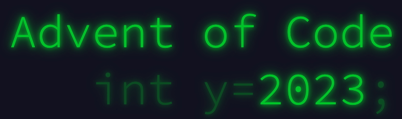

    

# Advent of Code 2023

[Advent of Code](https://adventofcode.com) is an Advent calendar of small programming puzzles for a variety of skill sets and skill levels that can be solved in any programming language you like. This repository contains solutions to the 2023 Advent of Code calendar.

Completed **2** out of **25** advent day puzzles.

Day | Puzzle | Solutions
--- | --- | ---
1 | [Trebuchet?!](https://adventofcode.com/2023/day/1) | 
2 | [Cube Conundrum](https://adventofcode.com/2023/day/2) | 
